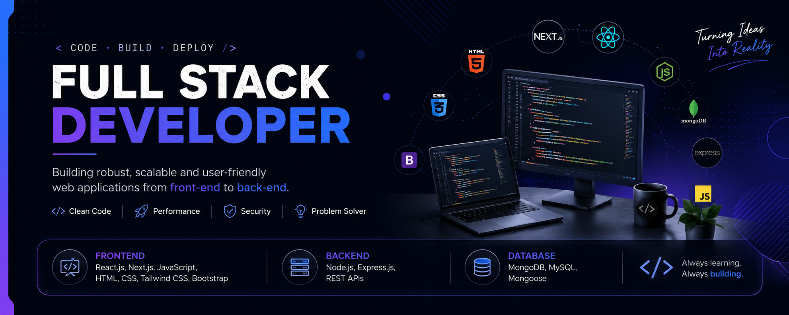

# Ashikur Rahman
### Full Stack Web Developer

---

I am a dedicated Full Stack Web Developer specializing in creating robust, scalable web applications from database architecture to user interface design. With a strong foundation in the MERN stack (MongoDB, Express, React, Node.js) and Next.js, I focus on building modern digital experiences with clean, performant, and maintainable code.

---

## 🚀 Current Activities

* 🔍 Exploring advanced performance features and server-side operations in **Next.js**.
* ✈️ Developing a full-stack **tourism and ticket booking platform** with secure backend routes.
* 🛠️ Optimizing database queries and API endpoints for seamless data flow.

---

## 🛠️ Tech Stack & Skills

### Frontend
     

### Backend & Database
  

### Tools & Platforms
  

---

## 🌐 Connect With Me

---

## 📊 Relevant GitHub Stats

  

  

  

  

